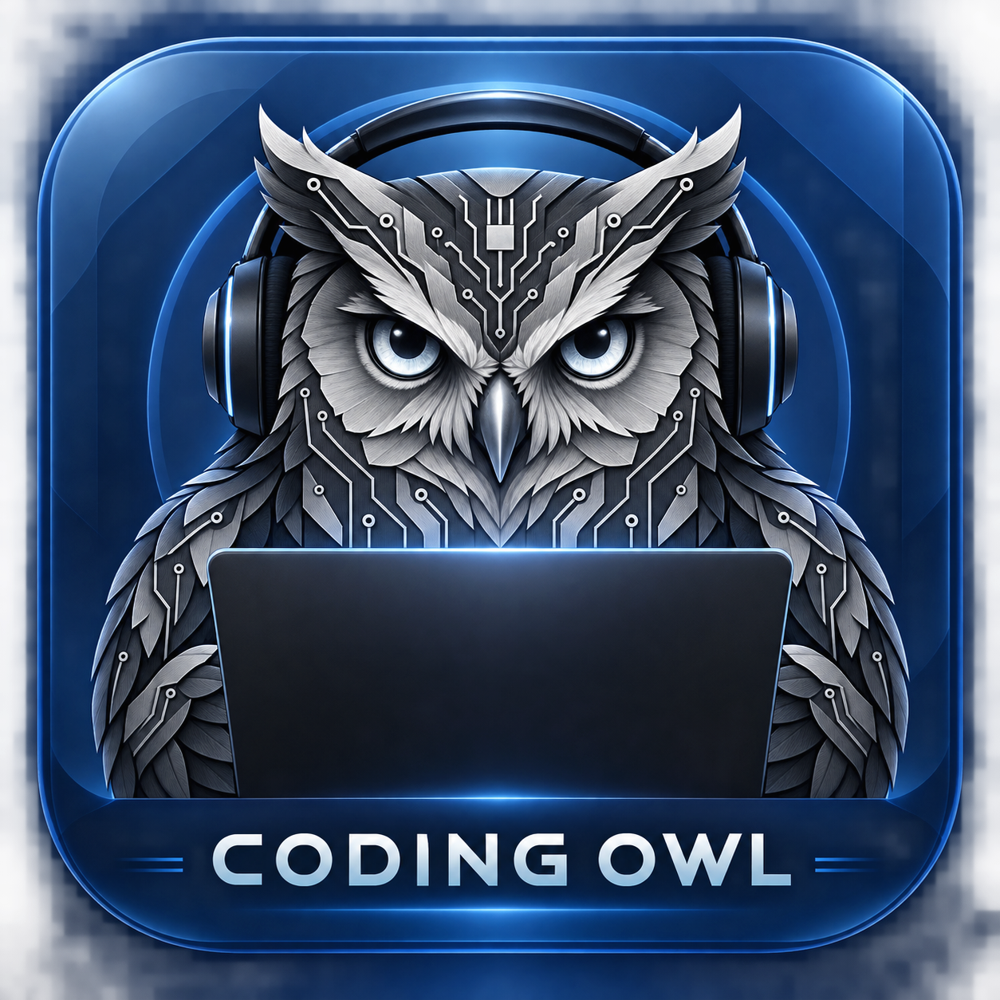

<p align="center">
  
</p>

# Coding Owl

Coding Owl runs coding agents on your machine while it is otherwise idle, so
that work you queued up happens while you are away and is waiting for review
when you come back.

You describe a piece of work, Owl queues it against one of your repositories,
and once your machine has been idle for a while it hands the work to an Agent
(Claude Code today) in a git worktree and branch of its own. When you sit back
down, Owl freezes the Agent and gives the machine back. When the work is done
and passes your project's checks, it lands in a branch for you to review.

## How it works

- **Jobs are queued, not run.** `owl add` records a standing intent to do one
  piece of work in one Project. The queue is first in, first out, and can be
  reordered.
- **Idle is the trigger.** By default Owl works only after ten minutes without
  keyboard or mouse input and with the machine on AC power. Both are
  configurable, and `owl start` and `owl pause` override them in either
  direction.
- **Every Job gets its own worktree and branch.** An Agent never touches your
  checkout. The branch is rebased onto the Project's base branch at the start of
  every Run.
- **Plan first, then execute.** A Job's first Run produces a plan, which becomes
  the execution prompt. Every Run starts in a fresh context and orients from a
  handoff document committed on the Job's branch, so a Job can take several
  Runs without any conversation surviving between them.
- **Giving the machine back is instant.** On your first input event Owl stops
  the Agent's whole process group. If the machine goes idle again within the
  grace window the same Run continues. Otherwise the Run ends and the next one
  picks up from the handoff.
- **Verification gates completion.** After the Agent exits, Owl runs the
  Project's checks from the base branch, out of the Agent's reach. A Job that
  passes goes to review. One that fails is blocked and says why.
- **You have the last word.** `owl jobs accept` keeps the work and reclaims the
  worktree. `owl jobs drop` deletes the branch and the worktree.

Owl is built around a small vocabulary - Project, Job, Run, Handoff, Idle,
Verification, Account, Driver, Executor - defined in [CONTEXT.md](CONTEXT.md).
Every decision behind the design is recorded in [docs/adr](docs/adr/README.md).

## Status

Owl is early software, versioned as v0.x.y, and currently ships for macOS on
Apple silicon only. Idle detection is implemented for macOS. Read the risks
below before you queue work.

## Risks

Owl runs an Agent on your machine while nobody is watching. Treat a Job the way
you would treat running the same tool yourself, unattended:

- **There is no sandbox.** Agents run as ordinary processes under your user,
  not in a container (ADR-0006). The worktree is where an Agent works, not a
  wall around it: an Agent can read and write anything you can, use the
  network, and reach whatever your user is signed in to, git remotes included.
- **The default allowlist runs code.** A new Account's Agents may edit files
  and run `git`, `make`, `go`, `npm`, `pnpm`, `yarn`, `npx`, `cargo` and
  `pytest` without asking. Build tools and package runners execute whatever a
  repository or a package tells them to, and `git` includes `git push`. The list
  is `accounts/<name>/settings.json` under Owl's data directory; narrow it if
  that is more than you want (ADR-0035).
- **Verification runs the Agent's code.** The checks come from the base branch,
  but they run against the Agent's changes, so a test the Agent wrote is a test
  that runs.
- **Time is capped by default; spend is not.** A Run ends when the Agent exits,
  when you come back to the machine, or when it passes one of its phase's
  limits - four hours of work or fifteen minutes of silence, by default, and
  configurable per phase. Spend is a separate question: `budgetUSD` in a
  Project's configuration caps what one Run may spend and an Account's `limits`
  keep Owl from starting work past a share of your subscription, but neither is
  set until you set it.
- **The desktop app is not notarised.** It is ad-hoc signed, and the cask
  clears macOS's quarantine flag so that Gatekeeper opens it. You are trusting
  the GitHub release rather than Apple's check.

## Installing

Owl ships as a Homebrew formula. Install it and keep the daemon running across
logins:

```
brew install vojtechmares/tap/coding-owl
brew services start coding-owl
```

The desktop app is a separate cask that depends on the formula:

```
brew install --cask vojtechmares/tap/coding-owl-desktop
```

On a machine without Homebrew, `owl daemon install` writes a launchd agent
that keeps `owl daemon run` running. The daemon never daemonizes itself; that
is launchd's job.

### Finding Claude Code

The daemon runs Claude Code on your behalf, so `claude` has to be somewhere the
daemon can find it. A daemon started from your shell has your `PATH`. A daemon
kept running by `brew services` does not: it gets a fixed `PATH` of Homebrew's
own directories plus `~/.local/bin`, which is where Claude Code's installer
puts `claude`. If yours is somewhere else, name it in the daemon's own file,
`config.yaml` in Owl's configuration directory:

```yaml
apiVersion: codingowl.dev/v1
claudePath: /path/to/claude
```

When `claudePath` is set the daemon uses it and does not look on `PATH`. When
it is not, the daemon looks on `PATH` and then under `~/.local/bin`. The daemon
reads the setting when it starts, so after changing it run
`brew services restart coding-owl`.

## Quick start

Adding an Account, registering a Project, telling Owl how to verify the work,
queueing a Job, letting it run and reviewing it in the morning, with the
commands for each: [Getting started](docs/guide/getting-started.md).

## Configuration

Every config file carries `apiVersion: codingowl.dev/v1`. Owl refuses a file
whose version or keys it does not recognise rather than guessing.

Both file kinds have a JSON schema, generated from the same structs Owl
decodes them with, so an editor can complete the keys and underline a
misspelled one where you type it rather than leaving it for `owl project show`
to refuse. Point your editor at one with a comment on the first line - VS Code,
Neovim and the JetBrains editors all read it through the YAML language server:

```yaml
# yaml-language-server: $schema=https://codingowl.dev/schema/project.json
```

```yaml
# yaml-language-server: $schema=https://codingowl.dev/schema/daemon.json
```

### Project configuration

Discovered in this order, first match wins:

1. `<project>/.coding-owl.yaml`
2. `<project>/.config/coding-owl.yaml`
3. `<project>/.meta/coding-owl.yaml`
4. `~/.config/coding-owl/<project-name>/config.yaml`

The in-repo forms are read from the Project's base branch, never from a Job's
worktree, so an Agent cannot weaken the checks that judge it. The fourth form
is for Projects that should carry no Owl file, and for overrides you do not
want committed. `owl project show` prints which file is in force.

```yaml
apiVersion: codingowl.dev/v1
account: work            # the Account this Project's Jobs run on
branchPrefix: owl/       # the default; Job branches are named under it
setup:                   # prepares each fresh worktree before an Agent starts
  - pnpm install --frozen-lockfile
checks:                  # shell commands; all run, every failure is reported
  - name: build
    run: go build ./...
  - name: test
    run: go test ./...
    timeout: 10m
  - name: fmt
    run: gofmt -l .
    expect: empty_output # default expectation is exit zero
verification:
  agent: true            # additionally have a fresh Agent review the diff
phases:                  # model, effort and limits per phase
  plan:
    model: anthropic/claude-opus
    effort: xhigh
    timeout: 1h          # the longest this phase's Agent may run at all
    stall: 15m           # the longest it may go without saying anything
  execute:
    model: anthropic/claude-sonnet
    timeout: 4h
allowedTools:            # what an unattended Agent may do without asking
  - Bash(go test:*)
skills:                  # reusable instructions fetched and pinned by Owl
  - git: owner/repo
    ref: main
unattendedClauses:       # appended to Owl's standing unattended contract
  - Never touch the migrations directory.
```

### Daemon configuration

`~/.config/coding-owl/config.yaml` holds global settings:

```yaml
apiVersion: codingowl.dev/v1
claudePath: /opt/homebrew/bin/claude
idle:
  after: 10m
  requirePower: true
graceWindow: 15m
maxParallelRuns: 2
accounts:
  work:
    limits:
      fiveHourMax: 60
      weeklyMax: 50
garbageCollection:
  interval: 1h
```

Account limits are percentages of a subscription's rate-limit window. Owl
will not schedule past them, measured against the account's total usage rather
than Owl's alone, so there is always room left for you.

### Account configuration

An Account's configuration directory is its coding tool's configuration
directory, so the tool's own commands are how that Account is configured. `owl
account exec` runs the tool against one:

```
owl account exec work -- mcp add --scope user sentry --transport http https://mcp.sentry.dev/mcp
owl account exec work -- plugin install some-plugin
owl account exec work -- mcp list
```

Everything after `--` is the tool's, passed through untouched, and the tool's
exit status is the command's. Owl models no MCP server and no plugin: it points
the tool at the right Account and gets out of the way.

Two things to know about an MCP server an Agent is meant to use. An unattended
Agent denies anything not on its allowlist, so the server's tools have to be
granted as `mcp__<server>__*` in the Account's `settings.json` or in a
Project's `allowedTools`. And a repository's own `.mcp.json` servers wait for
an approval nobody is awake to give, so user scope - what `--scope user` writes,
in the Account's own directory - is the one that works for a Run.

### Standing instructions

An Account carries standing instructions that every Run on it reads, whichever
Project the Run is for. They are the place for conventions that hold across all
of an Account's work, as against a Project's `unattendedClauses`, which hold
only for that Project.

```
owl account instructions edit work            # in $VISUAL, $EDITOR, or vi
owl account instructions set work < CLAUDE.md # from a file
owl account instructions show work
```

They are also editable in the desktop app. Owl keeps them in the Account's
configuration directory under the name that Account's tool reads instructions
from - `CLAUDE.md` for Claude Code - so the tool reads them itself and Owl
injects nothing. Saving blank text takes them away.

One file changes every Job on that Account, in every Project, so it is worth
keeping short. To read them back as an Agent on that Account would, ask it:

```
owl account exec work -- --print "what standing instructions are you under?"
```

### Filesystem layout

Owl honours the XDG variables on both macOS and Linux:

```
~/.config/coding-owl/        daemon config and per-Project fallback config
~/.local/share/coding-owl/   owl.db, worktrees, per-Account tool config, skills
~/.local/state/coding-owl/   daemon socket and per-Run logs
```

## Command overview

| Command | What it does |
| --- | --- |
| `owl project add\|list\|show\|rename\|move\|remove` | Register repositories as Projects |
| `owl account add\|list\|remove\|exec` | Manage the subscriptions Owl runs work on |
| `owl account instructions show\|set\|edit` | The standing instructions every Run on an Account reads |
| `owl add <prompt>` | Queue a Job, planned first unless `--no-plan` |
| `owl queue list\|reorder\|remove` | Show and reorder the queued Jobs |
| `owl start` / `owl pause` / `owl resume` | Override idle: run now, freeze everything, continue |
| `owl status` | What ran, what is running, what is waiting for you |
| `owl jobs show\|accept\|drop\|extend` | Inspect a Job, keep or refuse its work, give it more Runs |
| `owl jobs label add\|remove` | Change the labels a Job carries |
| `owl logs <run> [-f]` | The Agent's own structured stream, one event per line |
| `owl skills add\|list\|update\|remove` | Manage the Skills a Project gives its Agents |
| `owl models` | The models a Job's phases can run on, aliases and pinned |
| `owl providers add\|list\|remove\|supported` | Model providers the desktop chat speaks to, and the ones it can be configured with |
| `owl gc` | Reclaim finished worktrees, report what is unfinished |
| `owl daemon run\|install\|status` | Run, install and inspect the daemon |

Every command talks to the daemon over ConnectRPC on a unix socket. The CLI
and the desktop app are both clients; the daemon is the single source of truth.

For when to reach for which of them, the manual is in two pages:
[Working with Jobs](docs/guide/jobs.md) and
[Projects and Accounts](docs/guide/projects-and-accounts.md).

## Desktop app

The desktop app is a Wails application with a React frontend. It is a pure
view of the daemon: overview, queue, Jobs with their Runs, diffs, handoffs,
Verification results and logs. Everything it can do exists as a daemon RPC the
CLI can also call.

It also carries a chat, answered by the daemon. The chat proposes commands and
runs nothing without consent, and what it can run is a fixed allowlist of
read-only programs executed directly, without a shell, confined to a Project or
one of its worktrees. Which model answers it is configured with `owl providers`:
see [Chat model providers](docs/guide/chat-providers.md).

Screenshots live in [docs/desktop](docs/desktop).

## What Owl promises an unattended run

- The Agent's working directory is its Job's worktree, and the Job's branch is
  the only branch it works on.
- Verification config comes from the base branch, so the Agent being judged
  cannot change the rules.
- Every Run carries a standing unattended contract: make reasonable assumptions
  and write them down, commit incrementally, keep the handoff current, stop and
  say so when genuinely blocked, never guess at anything destructive.
  `owl jobs show` prints the effective system prompt so nothing is hidden.
- An Agent that ignores a request to stop is killed.
- Every Run ends. A phase's Agent is bounded both by how long it may run at all
  and by how long it may go without saying anything, so one that wedges on an
  untouched machine cannot hold the queue until morning. Passing either limit
  is the Job's own failure and spends one of its attempts, so a Job that does
  it every time is reported rather than retried for ever.
- Garbage collection never deletes uncommitted work. Anything that looks
  unfinished is reported under `owl status` for you to decide.

## Development

Owl is a single Go module. The CLI, the daemon and the desktop backend all live
in it; plugins (Drivers, Executors, Verifiers) are Go interfaces, not external
processes.

```
make build      # bin/owl
make test       # go test ./...
make lint       # go vet, gofmt, buf lint
make generate   # regenerate the ConnectRPC code from proto/
make desktop    # the Wails app; needs the Wails CLI, Node and pnpm
```

Behaviour tests in `tests/behavior` drive the built binary against a fake
Claude Code and a fake machine, one scenario file per issue. Releases are cut
by `scripts/release.sh`, which tags `main`; the release workflow builds the
tag, publishes the assets and updates the Homebrew tap.

Layout:

```
cmd/owl           the owl binary: CLI and daemon
cmd/owl-desktop   the Wails desktop app
internal/         daemon, queue, run, drivers, executor, verifier, gc, ...
proto/, gen/      ConnectRPC service definitions and generated code
deploy/launchd    the launchd agent template
docs/adr          architecture decision records
docs/agents       how AI agents work on this repository
docs/guide        getting started and the CLI manual
tests/behavior    end-to-end behaviour scenarios
```

Working on the repository with an agent? Start with [AGENTS.md](AGENTS.md).
